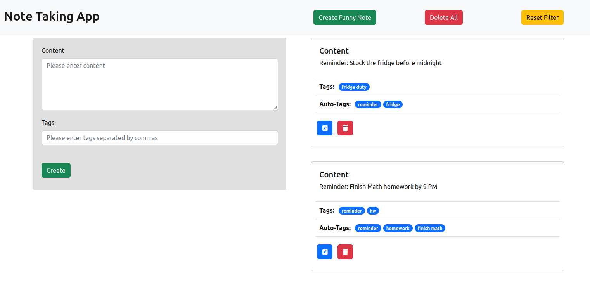

# Note Taking App
## Introduction
- This is a minimalistic looking notes taking web application built using **React** for the Frontend and **Flask** for the backend. 
- This app is simple to deploy as all the services have been containerized using **Docker** so it can run on any server. 
- It also uses a fully automated **Github Actions** CI pipeline to test if the backend APIs are returning the appropriate results. 
- **Bonus**: It also displays auto-tags if the user is not good at tagging their own notes. This has been implemented using **Google Cloud Platform's** Natural Language module which calls the Entity Recognition API to generate these tags automatically

## Features
1) Allows basic **CRUD applications** such as Create, Update, Get, and Delete certain notes or all notes in the database
2) The database is initialized using **Postgres** and runs in a separate container which means that the **data persists** in your machine as long as the docker volumes are not pruned. **Alembic** is used for data migration so that any new changes to the data models can be deployed to a production server without breaking any previously existing data

3) Extra features have been built in the frontend such as:  
a. **'Create a Funny Note'** which calls 2 external APIs and posts a joke  
b. **Form validation** on the frontend and backend to handle errors better  
c. **Fixed components** which do not scroll as you scroll down the list of tasks  
d. **Filter** all notes by clicking on an active tag or auto-tag  

4) Fully automated CI pipeline which uses **Pytest** to build and run the containers (just click the **'Actions'** tab in the GitHub repo to see under the hood 😉)
5) The backend runs production-ready code which utilizes **Gunicorn** and **Gevent** to spawn multiple workers which utilize multiprocessing to ensure app runs smoothly during high load

6) Uses **AI Cloud solutions** to improve auto-tagging of notes which can be filtered on thus providing the user more freedom of use of this app

7) Code base is comprehensively documented with comments, docstrings, type checks, and explainations to ensure a seamless review if any feature wants to be further scrutinized

## Build and Serve
This application was built using:
- Docker v20.10.18
- Docker Compose v2.9.0

Follow the following steps to start using this application:
1. Clone this repository in your local machine: `git clone https://github.com/atrikdas1/note-taking-app.git`
2. Make sure you have the right Docker and Docker Compose versions installed, otherwise it might throw odd bugs. You don't have to install anything else since the containers will install further prerequisites automatically!
3. Run the following step from inside the project folder: `docker-compose up -d --build`
4. Wait for the containers to build and start. Once done, head over to `http://localhost:3000/` and you should be able to see the fully functioning application
5. When you want to stop using the application, just tear down the containers with `docker-compose down`. If you also want to delete the database from your machine (essentially doing a 'Delete All'), just run `docker-compose down -v` to remove the volumes as well
